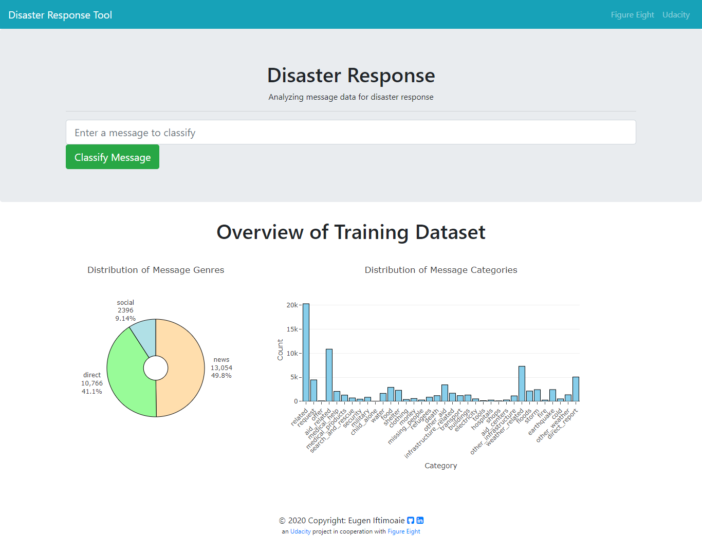

# Disaster Response Pipeline Project

Following a disaster we get typically millions of communications right at the time, either direct or by social media. This data needs to be collected and analyzed quickly for knowing at once which organizations need to be contacted for sending the help required.

The motivation of this project is to build a machine learning pipeline for categorizing emergency messages based on the needs communicated by the senders.

This project in form of a web app takes as input any text message and categorizes the emergency using a supervised machine learning model. This machine learning model was trainied on pre-labeled tweets, news and text messageas from a real life disasters data set provided by [Figure Eight](https://appen.com/resources/datasets/)

## Configuration
* HTML, CSS, Javascript
* Python 3 with libraries plotly, flask, pandas, numpy, sklearn, nltk, sqlalchemy (Back-end)

## Installation on local computer
For setting up your database and model you need to start the installation with step 1. There is already a database file and a model provided in this repository. In case you want to use these files you can start the installation with step 2.

1. Run the following commands in the project's root directory to set up your database and model.

  - run ETL pipeline that cleans data and stores in database
    `python data/process_data.py data/disaster_messages.csv data/disaster_categories.csv data/drp.db`
  - run ML pipeline that trains classifier and saves (info: this takes a few hours)
    `python models/train_classifier.py data/drp.db models/classifier.pkl`

2. Run the following command in the app's directory to run your web app.
    `python run.py`

3. open browser and type in url (for windows): http://localhost:5000/

Below are two screenshoots how the web app looks like: The screenshot on the left side shows the main page of the web app and the screenshot on the right side shows the classification result page.

<table align="center">
	<tr>
	    <td align="center" width="9999">
		
	   </td>
           <td align="center" width="9999">
		
	   </td>
        </tr>
</table>

## File Manifest
Below you can find the folder structure of the web app:

<pre><code class="lang-txt">

      - app
      | - templates
      | |- master.html (html main page of web app)
      | |- go.html (html classification result page of web app)
      | - run.py (python file with Flask app)

      - data
      |- disaster_categories.csv (csv file with data to process)
      |- disaster_messages.csv (csv file with data to process)
      |- drp.db (database with repaired data created with ETL Pipeline)
      |- process_data.py (python file with ETL Pipeline)

      - models
      |- classifier.pkl (file with saved supervised learning model)
      |- train_classifier.py (python file with ML Pipeline)

      - png (folder with png screenshot files for README)

      - README.md (markdown file with instructions)
      - LICENSE.md (markdown file with license of this software package)

</code></pre>

## Copyright and Licencing
This project is licensed under the terms of the MIT license

## Contact
Author: Eugen Iftimoaie

For questions feel free to contact me on my e-mail adress: eugen.iftimoaie@gmx.de
